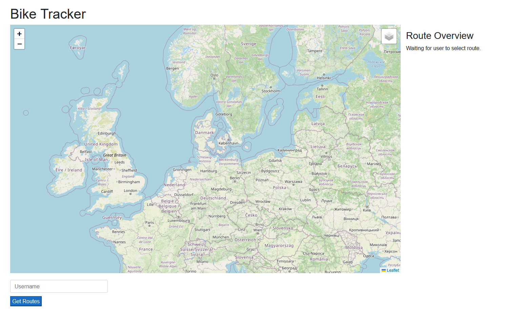
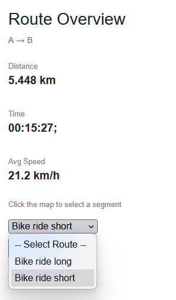
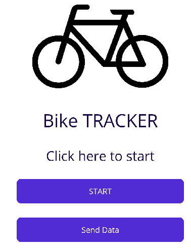

# Biketracker
This is a project for my BikeTracker, which takes GPS coordinates during a biking trip, compiles it up and showcases it on a frontend with statictics.

The project consists of a frontend, backend, database and a mobile application.

## Showcase

The following screenshots are images from respectively the frontend and the application.

### Frontend

### Mobile Application

